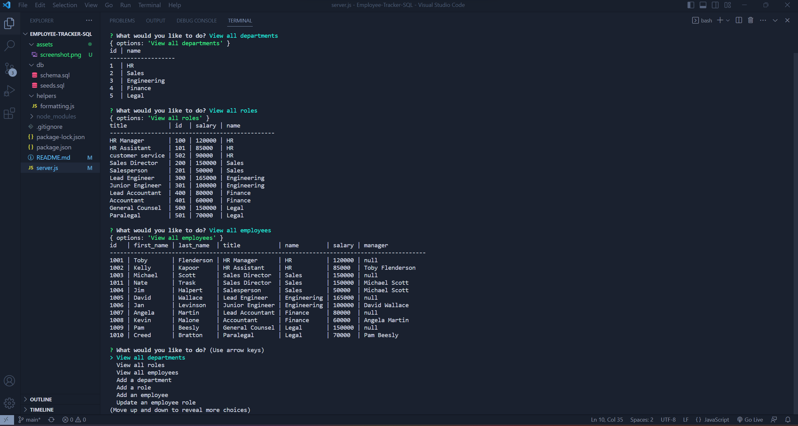

# Employee-Tracker-SQL

## Description

This is a command-line application to manage a company's employee database, using Node.js and MySQL. I learned how to manage data using mySQL along with using inquirer with databases. By using inquirers' prepared statements and prompts, the user doesn't need to write SQL scripts to perform different actions.

## Usage 
To use this application you will need Node.js and MySQL. First you will need to install inquirer, use 'npm i inquirer@8.2.4' and 'npm install --save mysql2'. From the db folder open an integrated terminal and enter 'mysql -u root -p'. After you're logged in to MySQL, enter 'source schema.sql' then 'source seeds.sql'. This will load the database and seeds. The final step is to open an integrated terminal from the server.js file and enter the command 'node server.js' to start the application. From there you can you use arrow keys to scroll through options and 'enter' to select an action. To watch a video breakdown, click [here](https://drive.google.com/file/d/1tb3ZNmfN0LNmVvHUAU3v8HLZ8Gz1F_pa/view)
